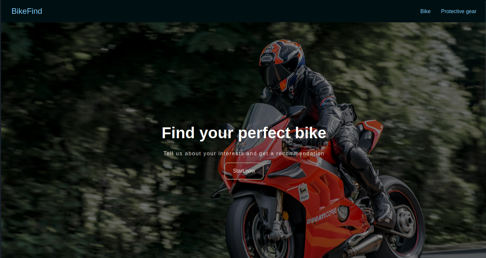
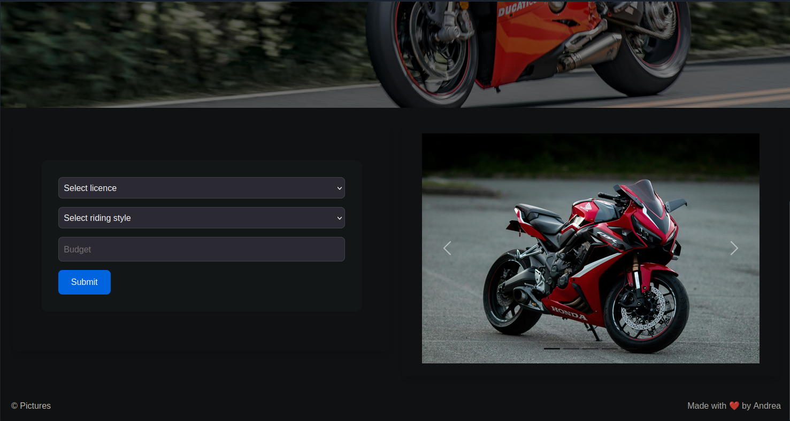
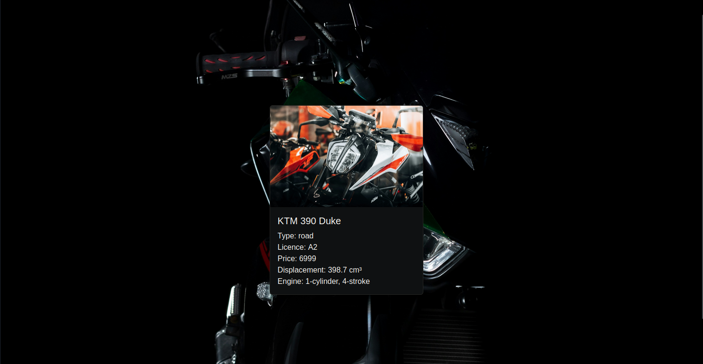

# BikeInterface

Interface with input option for the bike type, licence and budget which determines a recommendation for which bike would suit.

---

## Features
- Input bike type (street, sport, adventure, motocross etc.) which will search through currently available data based on bike type and budget and licence. (*note: the current .json data does not contain all possible bikes)
- Bike images for recommendation
- Additional information provided for the recommended bike 

---

## Screenshot

